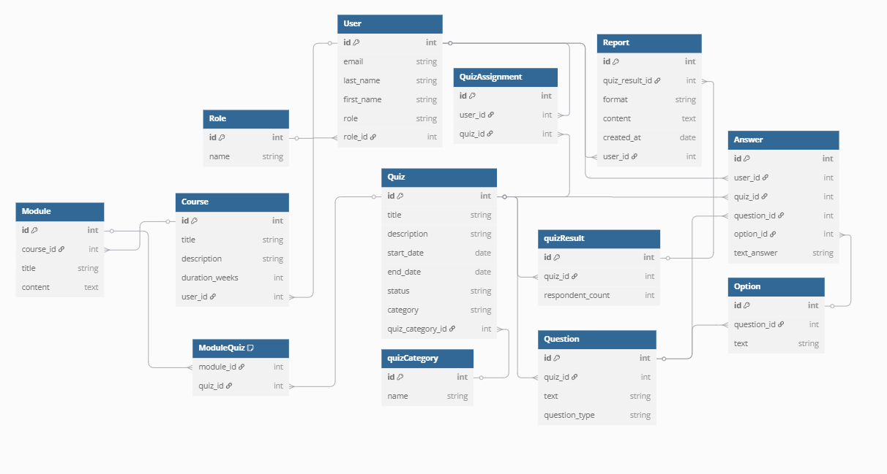

# Проєктування бази даних

В рамках проекту розробляється: 
- модель бізнес-об'єктів 
@startuml
left to right direction

' --- Сутності ---
entity User #ffffff
entity User.id #f2f3f4
entity User.first_name #f2f3f4
entity User.last_name #f2f3f4
entity User.email #f2f3f4

entity Role #e5e5e5
entity Role.id #d6d6d6
entity Role.name #d6d6d6

entity Quiz #a64dff
entity Quiz.id #a64dff
entity Quiz.title #a64dff
entity Quiz.description #a64dff
entity Quiz.start_date #a64dff
entity Quiz.end_date #a64dff
entity Quiz.status #a64dff

entity QuizAssignment #8e44ad
entity QuizAssignment.id #a569bd
entity QuizAssignment.user_id #a569bd
entity QuizAssignment.quiz_id #a569bd

entity Question #117864
entity Question.id #0e6251
entity Question.quiz_id #0e6251
entity Question.text #0e6251
entity Question.question_type #0e6251

entity Option #17a589 
entity Option.id #148f77 
entity Option.question_id #148f77 
entity Option.text #148f77 

entity Answer #1abc9c 
entity Answer.id #96eedd
entity Answer.user_id #96eedd 
entity Answer.quiz_id #96eedd 
entity Answer.question_id #96eedd 
entity Answer.option_id #96eedd 
entity Answer.text_answer #96eedd 

entity Course #4d79ff
entity Course.id #b3c6ff
entity Course.title #b3c6ff
entity Course.description #b3c6ff
entity Course.duration_weeks #b3c6ff

entity Module #000eb4
entity Module.id #7fb3d5
entity Module.course_id #7fb3d5
entity Module.title #7fb3d5
entity Module.content #7fb3d5

entity quizCategory #a64dff
entity quizCategory.id #d9b3ff
entity quizCategory.name #d9b3ff

entity quizResult #9b59b6
entity quizResult.id #d7bde2 
entity quizResult.quiz_id #d7bde2 
entity quizResult.respondent_count #d7bde2 

entity Report #cb4335
entity Report.id #ec7063 
entity Report.quiz_result_id #ec7063 
entity Report.format #ec7063 
entity Report.content #ec7063
entity Report.created_at #ec7063

' --- Атрибути ---
User *-u- User.id
User *-u- User.first_name
User *-u- User.last_name
User *-u- User.email

Quiz *-u- Quiz.id
Quiz *-u- Quiz.title
Quiz *-u- Quiz.description
Quiz *-u- Quiz.start_date
Quiz *-u- Quiz.end_date
Quiz *-u- Quiz.status

QuizAssignment *-- QuizAssignment.id
QuizAssignment *-- QuizAssignment.user_id
QuizAssignment *-- QuizAssignment.quiz_id

Question *-u- Question.id
Question *-u- Question.quiz_id
Question *-u- Question.text
Question *-u- Question.question_type

Option *-u- Option.id
Option *-u- Option.question_id
Option *-u- Option.text

Answer *-- Answer.id
Answer *-- Answer.user_id
Answer *-- Answer.quiz_id
Answer *-- Answer.question_id
Answer *-- Answer.option_id
Answer *-- Answer.text_answer

Course *-u- Course.id
Course *-u- Course.title
Course *-u- Course.description
Course *-u- Course.duration_weeks

Module *-u- Module.id
Module *-u- Module.course_id
Module *-u- Module.title
Module *-u- Module.content

Role *-u- Role.id
Role *-u- Role.name

quizCategory *-u- quizCategory.id
quizCategory *-u- quizCategory.name

quizResult *-- quizResult.id
quizResult *-- quizResult.quiz_id
quizResult *-- quizResult.respondent_count

Report *-- Report.id
Report *-- Report.quiz_result_id
Report *-- Report.format
Report *-- Report.content
Report *-- Report.created_at

' --- Зв’язки між сутностями ---
User "1,1" -- "0..*" QuizAssignment
Quiz "1,1" -- "0..*" QuizAssignment

Quiz "1,1" -- "0..*" Question
Question "1,1" -- "0..*" Option

User "1,1" -- "0..*" Answer
Quiz "1,1" -- "0..*" Answer
Question "1,1" -- "0..*" Answer
Option "0..1" -- "0..*" Answer

User "1,1" -- "0..*" Course : creates
Course "1,1" -- "0..*" Module : contains
Module "0..*" -- "0..*" Quiz : includes

Role "1,1" -- "0..*" User

quizCategory "1,1" -- "0..*" Quiz
Quiz "1,1" -- "0..1" quizResult
quizResult "1,1" -- "0..1" Report
User "1,1" -- "0..*" Report

@enduml

- ER-модель
@startuml
skinparam linetype ortho

' --- Сутності ---
entity "User" {
  + id : INT
  --
  email : STRING
  last_name : STRING
  first_name : STRING
  role : STRING
}

entity "Role" {
  + id : INT
  --
  name : STRING
}

entity "Quiz" {
  + id : INT
  --
  title : STRING
  description : STRING
  start_date : DATE
  end_date : DATE
  status : STRING
  category : STRING
}

entity "QuizAssignment" {
  + id : INT
  --
  user_id : INT
  quiz_id : INT
}

entity "Question" {
  + id : INT
  --
  quiz_id : INT
  text : STRING
  question_type : STRING
}

entity "Option" {
  + id : INT
  --
  question_id : INT
  text : STRING
}

entity "Answer" {
  + id : INT
  --
  user_id : INT
  quiz_id : INT
  question_id : INT
  option_id : INT
  text_answer : STRING
}

entity "Course" {
  + id : INT
  --
  title : STRING
  description : STRING
  duration_weeks : INT
}

entity "Module" {
  + id : INT
  --
  course_id : INT
  title : STRING
  content : TEXT
}

entity "quizCategory" {
  + id : INT
  --
  name : STRING  
}

entity "quizResult" {
  + id : INT
  --
  quiz_id : INT
  respondent_count : INT
}

entity "Report" {
  + id : INT
  --
  quiz_result_id : INT
  format : STRING
  content : TEXT
  created_at : DATE
}

' --- Зв’язки ---
"User" ||--o{ "QuizAssignment"
"Quiz" ||--o{ "QuizAssignment"

"Quiz" ||--o{ "Question"
"Question" ||--o{ "Option"

"User" ||--o{ "Answer"
"Quiz" ||--o{ "Answer"
"Question" ||--o{ "Answer"
"Option" |o--o{ "Answer"

"User" ||--o{ "Course"
"Course" ||--o{ "Module"
"Module" }o--o{ "Quiz"

"Role" ||--o{ "User"
"quizCategory" ||--o{ "Quiz"
"Quiz" ||--o| "quizResult"
"quizResult" ||--o| "Report"
"User" ||--o{ "Report"

@enduml

- реляційна схема

